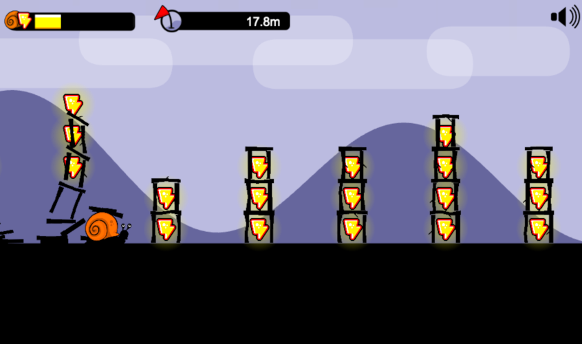

# 🚀 Welcome to RunSnail project!

My submission to contest organized by [ATZOD](https://www.youtube.com/c/Atenznowodronach) (YouTube channel about FPV quadcopters). The contest was related to [Walksnail](https://walksnail.com/) technology which allows transmission of HD video from a quadcopter to FPV goggles. 

**The rules are simple**:
- In a creative way, answer the question: *"How does a snail walk?"*

Full rules of the contest are available [here](https://znowodronach.pl/pl/blog/KONKURS-Jak-chodzi-slimak/27)

If you haven't heard about FPV quadcopters before, check [this](https://www.youtube.com/watch?v=C-ZbNhIoUp0) out :) 

# Demo

The game demo is available here: [http://runsnail.jmrlab.com](http://runsnail.jmrlab.com/)

# System Requirements

The game is a web app and should run on any modern web browser, including **desktop** and **mobile**.

# Credits

Background music from Uppbeat (free for Creators!):
https://uppbeat.io/t/ra/let-good-times-roll